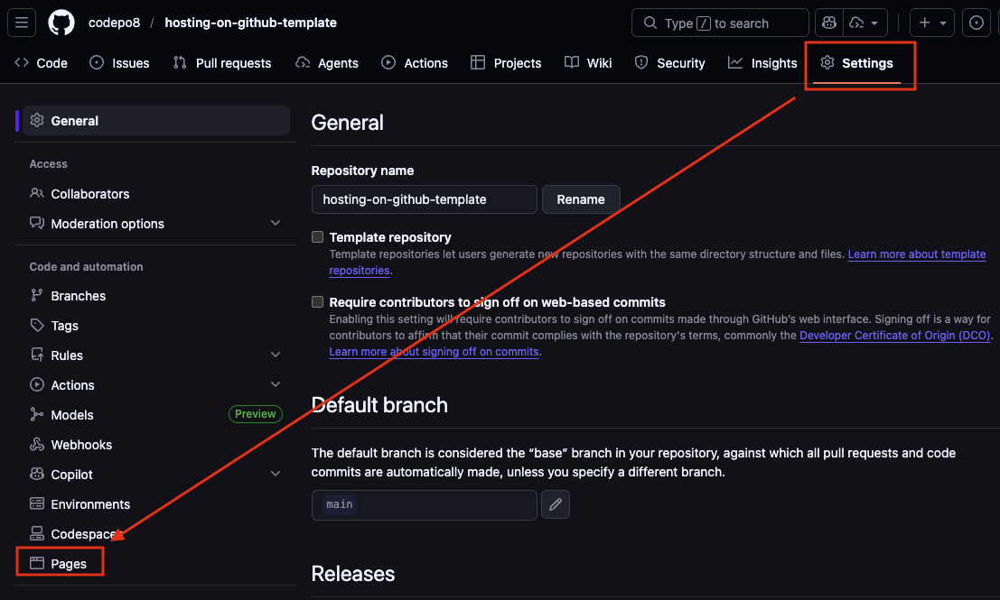
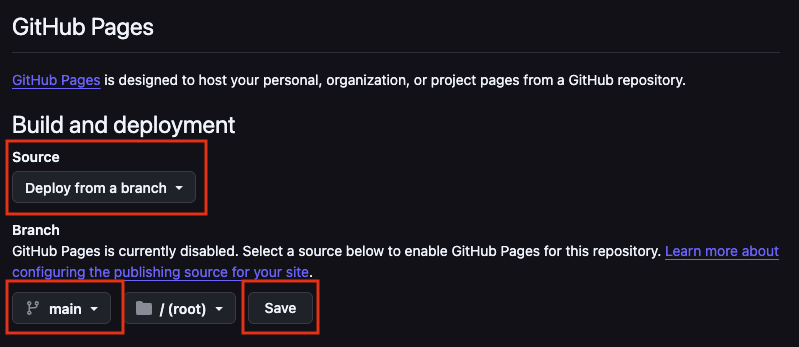
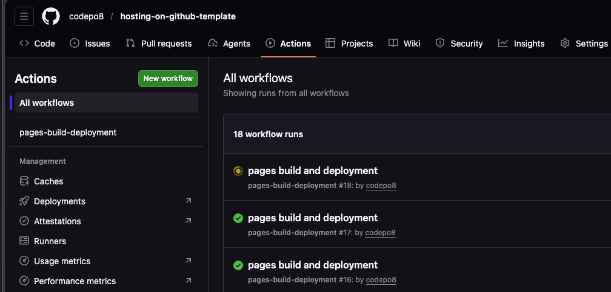
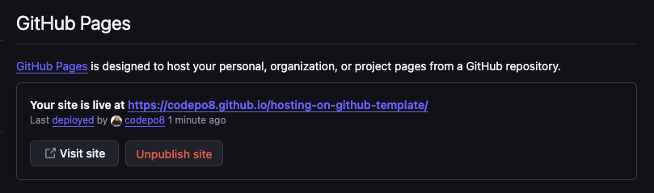
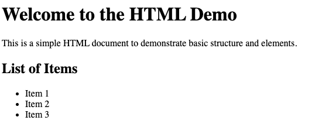
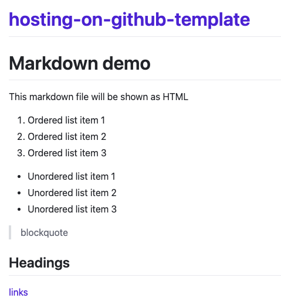
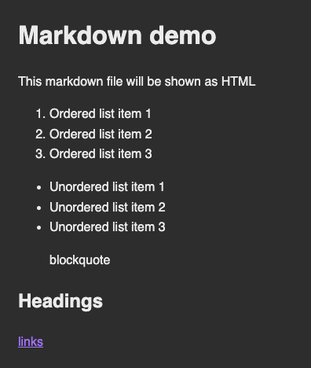
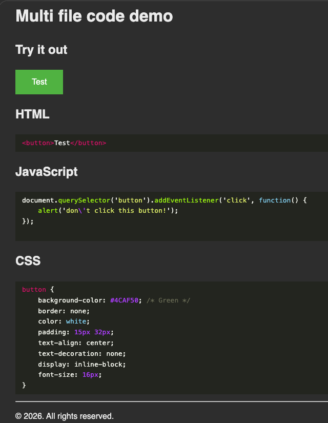

# Hosting HTML/CSS/JS on GitHub

> This is a bare-bones example how to host an HTML/CSS/JavaScript example page on GitHub pages. You can fork this repo and get started. 

## Step 1: Create a new repository (or fork this one)

The first step is to get a GitHub account and create a new repository. This one, for example is called `hosting-on-github-template` and is available at `https://github.com/codepo8/hosting-on-github-template` with `codepo8` being my user name. 

## Step 2: Turn on GitHub Pages

1. Go to the settings of the repository and go to pages in the secondary navigation:

    
1. Select `Deploy from a branch` under `Build and deployment`, choose the `main` branch and the `root` folder and press save.

    

    This triggers the build of the page. 
1. Check the `Actions` tab of the main navigation to see the page being built. 

    
    Whilst building this shows a yellow animated dot. When it is done it turns into a green check mark. If there are some issues it will show an error icon and explain what went wrong. Once it is in the green, your changes are live. 
1. When the page is done building you can see in the `Pages` section that it has been deployed. 

    

    Your page is now available on the web as an HTML/CSS/JS capable environment. For example, this one is at https://codepo8.github.io/hosting-on-github-template/.

    The structure is `https://{​{user}​}.github.io/{​{repository_name}​}/` and comes from the repository URL at `https://github.com/{​{user}​}/{​{repository_name}​}`. 

## Step 3: Host your HTML/CSS/JS 

And that's all there is to it. You can now put HTML/CSS/JS documents, images and videos into your repository and they will be shown in the browser under the pages URL. For example, the [simple-html-demo.html](https://github.com/codepo8/hosting-on-github-template/blob/main/simple-html-demo.html) file here is available rendered as HTML at [https://codepo8.github.io/hosting-on-github-template/simple-html-demo.html](https://codepo8.github.io/hosting-on-github-template/simple-html-demo.html).



Every time you change the code and push to the repository the build process runs in the background and the pages get deployed.

## Advanced: Use templates to publish Markdown content as HTML

Instead of simply hosting HTML, you can also write your content in markdown and have GitHub show it as HTML pages. For example, the [markdown.md](https://github.com/codepo8/hosting-on-github-template/blob/main/markdown.md) file is available as html at [https://codepo8.github.io/hosting-on-github-template/markdown](https://codepo8.github.io/hosting-on-github-template/markdown) or [https://codepo8.github.io/hosting-on-github-template/markdown.html](https://codepo8.github.io/hosting-on-github-template/markdown.html). 



The issue here is that you might not be happy with the out-of-the-box rendering of GitHub and especially the listing of the repository name as the main heading. To change it, you can create your own HTML templates. For this to work, you need to create a folder called `_layouts` in your repository and create an HTML document in there. A [bare bones example](https://github.com/codepo8/hosting-on-github-template/blob/main/_layouts/simple.html) called `simple.html` is part of this repository.

```html
<!DOCTYPE html>
<html lang="en">
<head>
    <meta charset="UTF-8">
    <meta name="viewport" content="width=device-width, initial-scale=1.0">
    <title>{​{​ page.title ​}​}</title>
    <style>
        :root {
             color-scheme: light dark;
        }
        body {
            font-family: sans-serif;
            margin: 2em;
            line-height: 1.6;
            background: light-dark(#eee, #333);
            color: light-dark(#333, #eee);
        }
    </style>
</head>
<body>
    {​{​ content ​}​}
</body>
</html>
```

The parts surrounded by curly braces are variables. The `{​{​ page.title ​}​}` will come from a title defined in the markdown's front matter and the `{​{​ content ​}​}` part means that this is where the content of the markdown file goes. 

In your [markdown file](https://github.com/codepo8/hosting-on-github-template/blob/main/markdown-with-template.md) you create a front matter section with a title and a template. The title could be whatever you want and will be what displays the `{​{​ page.title ​}​}` in the template. The `layout` needs to be file name of the HTML template in the `_templates` folder without `.html`.


This now [renders without the header](https://codepo8.github.io/hosting-on-github-template/markdown-with-template) and with any of the CSS, JavaScript or media you added to the template. 



You can also define a different file name in the front matter as `permalink`:

```markdown
---
title: markdown with template
layout: simple
permalink: othername.html
---
… more …
```

This makes [markdown-with-template-filename.md](markdown-with-template-filename.md) is now available at [https://codepo8.github.io/hosting-on-github-template/othername.html](https://codepo8.github.io/hosting-on-github-template/othername.html) although there is no file called `othername.html` in the repository. 

## Advanced: Display colour coded source code

Commonly GitHub pages are used to show demos of the code in the repository and whilst it is easy to link to the source display in the repository, you might want to include colour coded source examples in your pages. To accomplish this, you need to do the following:

1. Create a file in the root of your repository called `_config.yml`. 
1. Add the following code: 
    ```yml
    markdown: kramdown
    highlighter: rouge
    ```
    This tells GitHub pages tp use the [rouge highlighter](https://kramdown.gettalong.org/syntax_highlighter/rouge.html) to show source code.

You then can use code fences (three backticks) to show source code. For example, the following:

```
​​`​​`​`javascript
while(life + universe + everything) {
    return 42;
}
​`​​`​`
```

Will result in: 

```javascript
while(life + universe + everything) {
    return 42;
}
```

You can check the [codedemo.md](https://github.com/codepo8/hosting-on-github-template/blob/main/codedemo.md) example to see this in action. The rendered [codedemo.html](https://codepo8.github.io/hosting-on-github-template/codedemo.html) displays the source code.

*Important*: In order to display the code in different colours, you need to provide the source colours. In this example here they are in the `assets` folder as [sourcecode.css](https://github.com/codepo8/hosting-on-github-template/blob/main/assets/sourcecode.css) which is referenced in the [sourcecode.html](https://github.com/codepo8/hosting-on-github-template/blob/main/_layouts/sourcecode.html) template in the `_layouts` folder:

```html
<!DOCTYPE html>
<html lang="en">
<head>
    <meta charset="UTF-8">
    <meta name="viewport" content="width=device-width, initial-scale=1.0">
    <title>Source Code Display</title>
    <link rel="stylesheet" href="/hosting-on-github-template/assets/sourcecode.css">
</head>
```

### Using includes 

Templates also have another benefit over static HTML pages - you can use includes to seperate repeated elements out into into own files. There are two ways to do that. The first one is global includes for the repository.

1. Create a folder called `_includes` in the root of the repository.
1. Add the files you want to become includes there. For example, to add a footer, you can create a `footer.html` document. 

    ```html
    <footer>
        <hr>
        <p>&copy; 2026. All rights reserved.</p>
    </footer>
    ```
1. In your template, you can now include this using `{​​% include footer.html %​​}`. This file needs to be available in the `_includes` folder to work. You can see it in action at the [code demo](https://codepo8.github.io/hosting-on-github-template/codedemo.html). 

You can also include one file into another one using the `{​​% include_relative path/file %​​}` syntax. And this allows for a great way of showing your code in action and as source code at the same time.

## Demo: showcasing an HTML/CSS/JS example with 

Putting these together, you can showcase any HTML/CSS/JS features executed and as source code. Check out the [Code example](https://codepo8.github.io/hosting-on-github-template/code_example/) in this repository. 



You can see the source of this one in [the `code_example` folder](https://github.com/codepo8/hosting-on-github-template/tree/main/code_example). 

You can click the button in the demo to see it in action. Both the functionality and the source display comes from the same files, which means maintenance of the demo is a breeze. 

The way this works is the [index.md](https://github.com/codepo8/hosting-on-github-template/tree/main/code_example/index.md) file in the folder. 


This way all you need to do to create changes in the demo is to change the source files. The demo page automatically updates with them.


